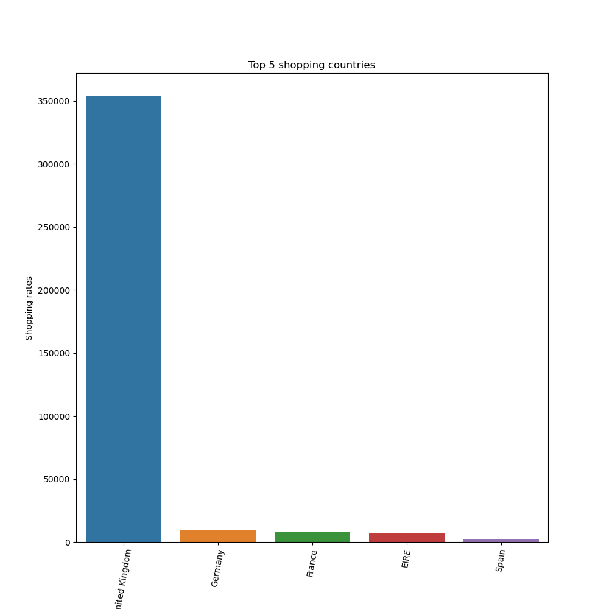
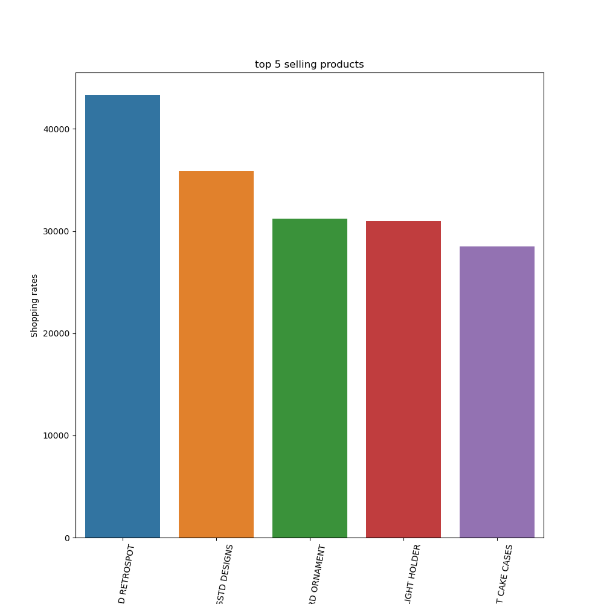
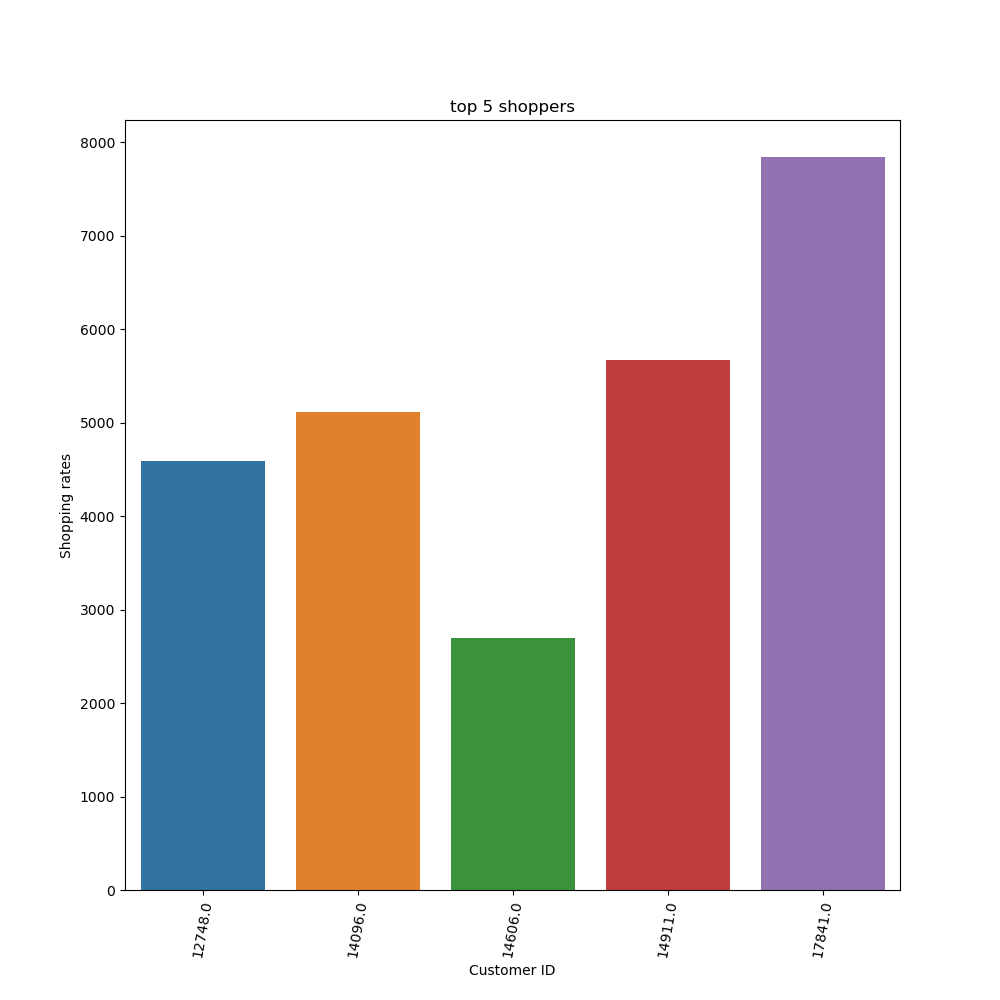
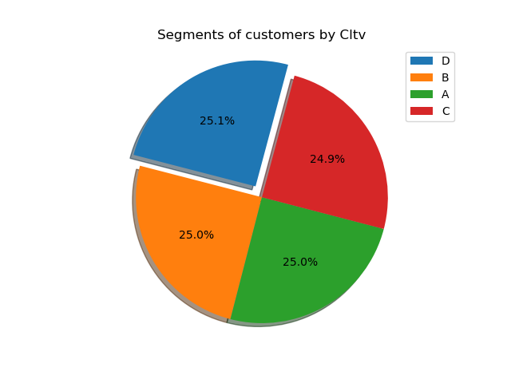

# BG-NBD ve Gamma-Gamma ile CLTV Prediction

### Business Problem
The UK-based retail company wants to set a roadmap for its sales and marketing activities.
Existing customers so that the company can make a medium-long-term plan the potential value 
they will provide to the company in the future needs to be estimated.

### Dataset Story
The data set named Online Retail II was obtained from a UK-based online store.
Includes sales between 01/12/2009 - 09/12/2011.
This company sells souvenirs and the majority of the company's customers are wholesalers.
https://archive.ics.uci.edu/ml/datasets/online+retail

